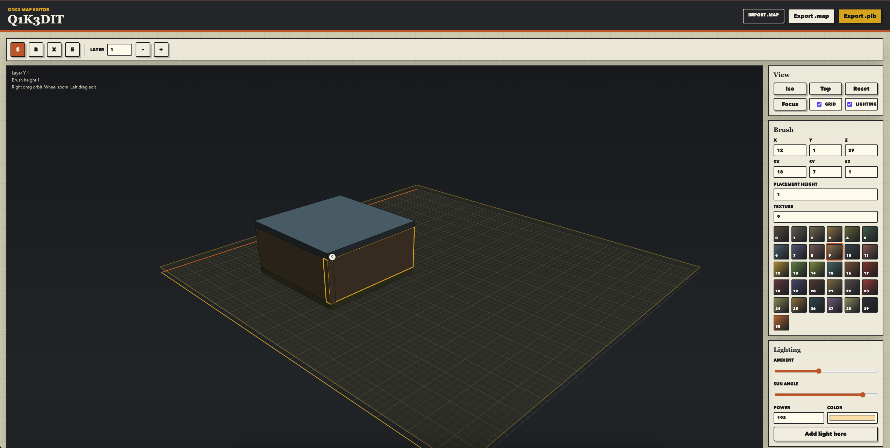

# Q1K3DIT

Q1K3DIT is a browser based 3D block level editor for the Q1K3 JavaScript engine in `/Users/jsh/dev/repos/q1k3`.



Save the current editor screenshot at `docs/q1k3dit-3d-editor.png` to render it in this README.

## Features

- 3D perspective viewport with orthographic top view
- Axis aligned Q1K3 brush editing
- Entity placement for Q1K3 runtime entity types
- Light entity placement with power and packed color controls
- Ambient and sun-angle lighting preview
- Quake `.map` import and export
- Packed `.plb` export matching Q1K3 `source/map.js`
- Tooling to add maps to Q1K3 and serve the built game over HTTP

## Editor Controls

- `S`: select brushes or entities
- `B`: drag to place a brush on the current layer
- `X`: erase brushes or entities
- `E`: place the selected entity type
- `Delete` or `Backspace`: delete the selected brush or entity
- Right mouse drag or option drag: orbit the 3D camera
- Middle mouse drag: pan the viewport
- Mouse wheel: zoom the 3D camera
- Layer controls: choose the active Q1K3 Y layer
- Placement height: choose how tall newly dragged brushes are
- `Iso`: perspective editing view
- `Top`: true orthographic top-down view
- `Reset`: reset the camera
- `Focus`: move the camera target to the selected brush or entity

## Lighting

Q1K3 lights are regular entities. The lighting panel creates and edits `light` entities:

- Ambient changes only the editor preview.
- Sun angle changes only the editor preview.
- Power maps to the Q1K3 `light` key and packed entity data.
- Color is packed to the same 8-bit color format used by Q1K3.
- `Add light here` places a light near the current camera target.

## Engine Fit

Q1K3 uses axis aligned block maps after packing:

- X and Z grid cells are 32 engine units.
- Y grid cells are 16 engine units.
- `.map` export writes Quake map coordinates for `pack_map.c`.
- `.plb` export writes the packed block and entity format consumed by `source/map.js`.

The importer only edits axis aligned brushes. More complex TrenchBroom brushes are counted as skipped instead of being converted incorrectly.

## Open The Editor

Open `index.html` in a browser:

```sh
open index.html
```

## Play In Q1K3

Use the included tooling from this directory:

```sh
make add-map MAP=/path/to/q1k3dit.map NAME=my_map BUILD=1
make serve
```

Then open:

```text
http://127.0.0.1:8000/build/index.html
```

`add-map` copies the map into `/Users/jsh/dev/repos/q1k3/assets/maps`, regenerates the map packing section of Q1K3 `build.sh`, and updates Q1K3's runtime map count in `source/game.js`.

## Server Script

Start the local Q1K3 HTTP server with:

```sh
./start-server.sh
```

Optional overrides:

```sh
PORT=8001 ./start-server.sh
Q1K3_DIR=/path/to/q1k3 ./start-server.sh
```

## Useful Commands

```sh
make add-map MAP=/path/to/q1k3dit.map NAME=my_map
make add-map MAP=/path/to/q1k3dit.map NAME=my_map BUILD=1
make sync-maps BUILD=1
make serve PORT=8001
make serve-build
```

The underlying CLI is:

```sh
uv run python tools/q1k3dit.py add-map /path/to/q1k3dit.map --name my_map --build
uv run python tools/q1k3dit.py serve --port 8000
```
